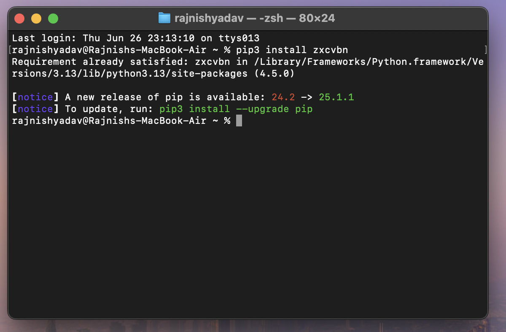
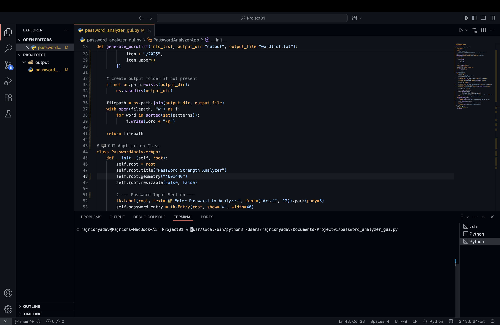

#Password Strength Analyzer & Custom Wordlist Generator

A Python-based tool with GUI interfaces that helps users analyze the strength of their passwords and generate targeted wordlists using personal information — useful for understanding brute-force attacks and cybersecurity awareness.

---

##  Features

✅ Analyze password strength using the `zxcvbn` library
✅ Estimate password crack time (offline attacks)
✅ Suggest improvements for weak passwords
✅ Generate smart wordlists using personal data
✅ GUI built with `tkinter`
✅ Save wordlist as `output/wordlist.txt`
---

## Tech Stack

- Python 3.13
- `tkinter` – GUI
- `zxcvbn` – Password strength estimator
- `os` – Folder and file management

##  How to Run

### 1. Install Required Library
--pip3 install zxcvbn

--tkinter is built-in on most systems like macOS and Windows.

###2. Run the App
bash
Copy
Edit
python3 password_analyzer_gui.py
--A window will open where you can:

## 🖼️ GUI Preview
--Enter a password and check its strength
--Enter personal info (e.g., tom jerry 9876 12345) and generate a wordlist

**OUTPUT***
Wordlist Output

👉 [Click here to view the generated wordlist](wordlist.txt)

---

<pre> ## 📦 Project Structure <code> password-strength-analyzer/ ├── 🧠 password_analyzer_gui.py # Main Python GUI application ├── 📄 password_analyzer_report.pdf # (Optional) 2-page project report ├── 🖼️ screenshot_gui.png # (Optional) GUI preview image ├── 📁 output/ │ └── 🧾 wordlist.txt # Generated wordlist file ├── 📘 README.md # Project documentation (this file) </code> </pre>
