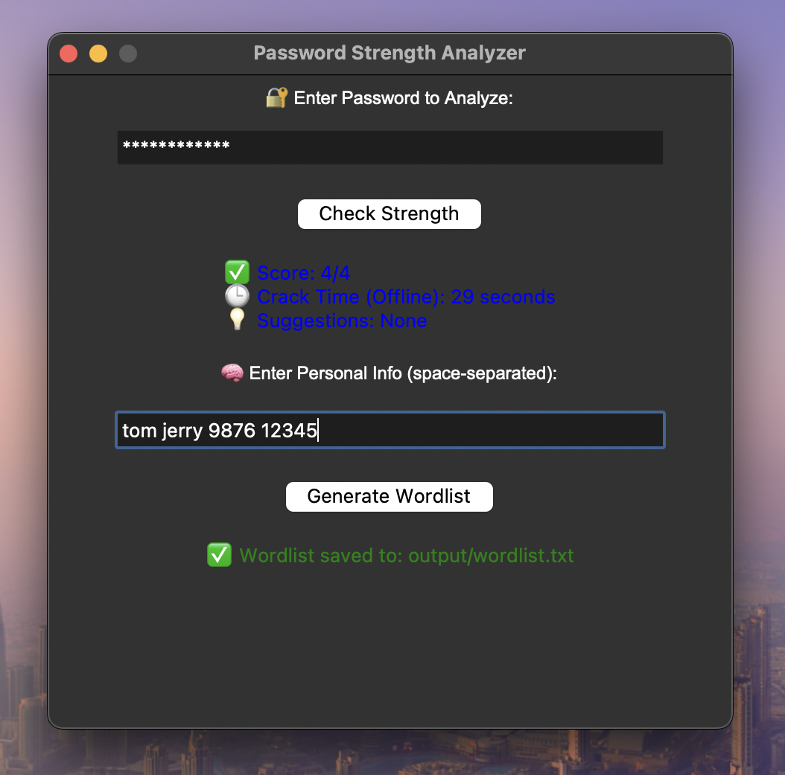

#Password Strength Analyzer & Custom Wordlist Generator

A Python-based tool with GUI interfaces that helps users analyze the strength of their passwords and generate targeted wordlists using personal information — useful for understanding brute-force attacks and cybersecurity awareness.

---

##  Features

✅ Analyze password strength using the `zxcvbn` library
✅ Estimate password crack time (offline attacks)
✅ Suggest improvements for weak passwords
✅ Generate smart wordlists using personal data
✅ GUI built with `tkinter`
✅ Save wordlist as `output/wordlist.txt`
---

## Tech Stack

- Python 3.13
- `tkinter` – GUI
- `zxcvbn` – Password strength estimator
- `os` – Folder and file management

##  How to Run

### 1. Install Required Library
pip3 install zxcvbn
tkinter is built-in on most systems like macOS and Windows.

###2. Run the App
bash
Copy
Edit
python3 password_analyzer_gui.py
--A window will open where you can:

## 🖼️ GUI Preview
--Enter a password and check its strength
--Enter personal info (e.g., tom jerry 9876 12345) and generate a wordlist

---

## 📦 Project Structure

password-strength-analyzer/
├── password_analyzer_gui.py # GUI version (main app)
├── password_analyzer_report.pdf # (Optional) 2-page project report
├── screenshot_gui.png # Preview image of the GUI
├── output/
│ └── wordlist.txt # Generated wordlist
├── README.md # This file
